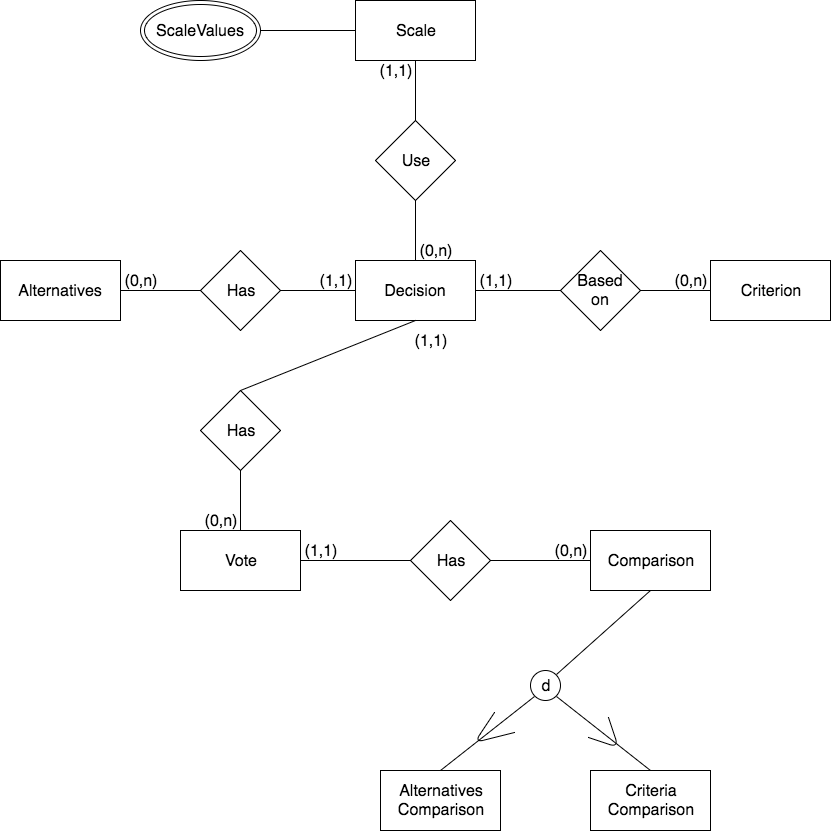

# AHP #

This project is an implementation of the AHP (Analytic Hierarchy Process) algorithm. It's a generic decision analyzer, which means you can define your own criteria and alternatives for your customized decision process.

## Technologies ##

* React.js
* Python/Django
* PostgreSQL

## About the AHP algorithm ##

The analytic hierarchy process (HP) is a structured technique for organizing and analyzing complex decisions, based on mathematics and psychology. It was developed by Thomas L. Saaty in the 1970s and has been extensively studied and refined since then.

It has particular application in group decision making and is used around the world in a wide variety of decision situations, in fields such as government, business, industry, healthcare, shipbuilding, and education.

Rather than prescribing a "correct" decision, the AHP helps decision makers find one that best suits their goal and their understanding of the problem. It provides a comprehensive and rational framework for structuring a decision problem, for representing and quantifying its elements, for relating those elements to overall goals, and for evaluating alternative solutions.

## Data model ##

### Entity Relationship Diagram ###

### Relational Model ###

Scale(__id__, title, description)

ScaleValues(**scale_id, value**)

Decision(__id__, title, description, status, encoded_url, participants_qty, creation_date, end_date, *scale_id*)

Criterion(__id__, title, *decision_id*)

Vote(__id__, finished, *decision_id*)

CriteriaComparison(__id__, how_many_times, *better_id*, *alternative1_id*, *alternative2_id*, *vote_id*)

AlternativesComparison(__id__, how_many_times, *better_id*, *alternative1_id*, *alternative2_id*, *vote_id*)
